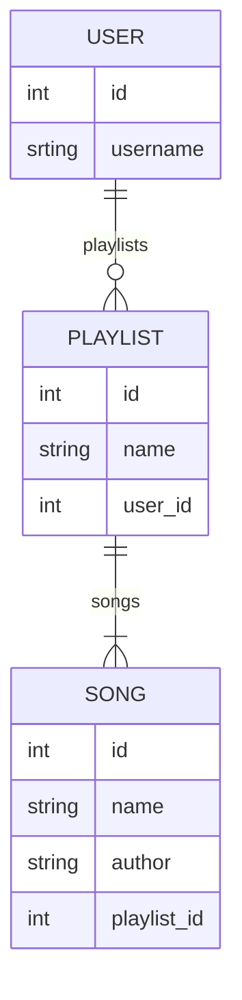

# Live Coding Round for Django

## ERM for the project

```mermaid
erDiagram
    USER {
        int id
        srting username
    }
    PLAYLIST {
        int id
        string name
        int user_id
    }
    SONG {
        int id
        string name
        string author
        int playlist_id
    }
    USER ||--o{ PLAYLIST : playlists
    PLAYLIST ||--|{ SONG : songs
```
